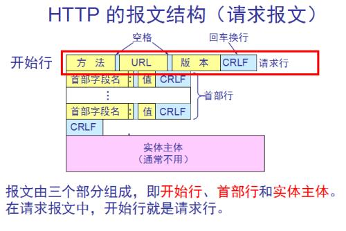
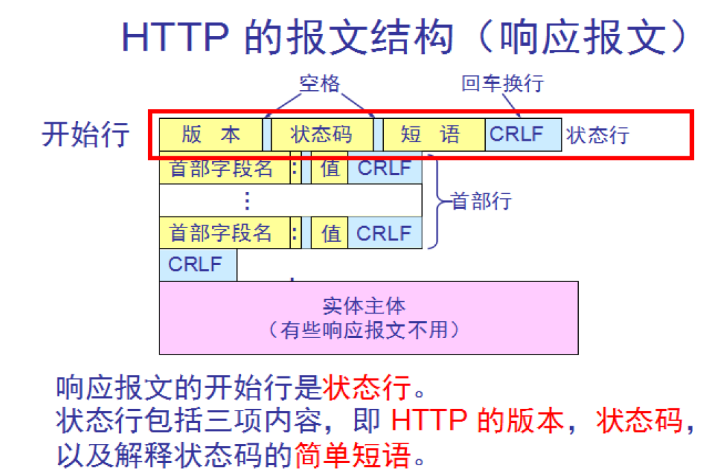
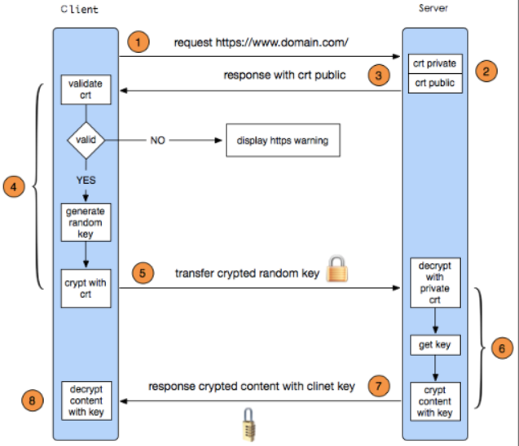

# 应用层协议

## 1、HTTP

HyperText Transfer Protocol 超文本传输协议，端口号HTTP 80、HTTPS 443，TCP连接。

### 1.1 HTTP版本演化

* HTTP/0.9 仅支持GET请求方式，仅支持请求访问HTML格式资源；

* HTTP/1.0 支持GET、POST、HEAD三种请求方式，根据Content-Type可请求多种格式的文件。非持续连接，每个TCP连接只能发送一个请求，服务器端回应后关闭连接。

* HTTP/1.1 增加了PUT、DELETE、OPTIONS、PATCH等请求方式。持续连接，一个TCP连接可发送多个请求，按顺序回应，为防止队首阻塞，可减少请求数或多开连接。

* HTTP/2.0 对于多个请求可并发处理，增加了双工模式，服务器端可主动向客户端push消息。

* HTTPS 基于SSL的HTTP协议，增加了身份认证和加密传输，保证安全性。

### 1.2 HTTP请求方式

* GET 请求指定页面信息并返回实体主体，是常用的请求方式；

* HEAD 类似于GET，但返回的响应中没有实体，只有报头，常用于测试；

* POST 向指定资源提交数据，数据包含在请求体中；

* PUT 向指定的资源位置上更新数据；

* DELETE 删除指定位置处的资源；

* CONNECT HTTP/1.1 协议中预留给能够将连接改为管道方式的代理服务器；

* OPTIONS 允许客户查看服务器性能；

* TRACE 回显服务器收到的请求，用于测试或诊断；

* PATCH 对PUT的补充，对资源进行局部更新。

### 1.3 HTTP常见状态码

* 1xx Informational信息性状态码，表示接受的请求正在处理；

* 2xx Sucess成功状态码，表示请求正常处理完毕；
    
    - 200 OK 请求被正常处理并返回
    
    - 204 No content 请求被正常处理，但返回的报文中没有实体
    
    - 206 Patial content 返回客户端指定的请求范围
    
* 3xx Rediration重定向状态码，需要进行附加操作以完成请求；

    - 301 Moved Permanently 永久重定向
    
    - 302 Found 临时重定向
    
    - 304 Not Modified 客户端已拥有资源，并且服务器端没有改变时返回
    
* 4xx Client error客户端错误状态

    - 400 Bad Request 请求报文中存在语法错误
    
    - 401 Unauthorized 未经许可，需要认证
    
    - 403 Forbidden 访问权限出现问题，服务器拒绝访问
    
    - 404 Not Found 没有找到请求资源

* 5xx server error 服务器处理请求时出错

    - 500 Internal server error 通用的服务器错误响应
    
    - 503 Server Unavaliable 服务器暂时处于超负载或停机状态，无法处理请求
    
### 1.4 HTTP请求和响应报文

* 请求报文由请求行（请求方式，URL，协议版本）、请求头部、请求数据三部分组成；

* 响应报文由响应行、响应头、响应体三部分组成.

### 1.5 HTTP会话跟踪机制

* Cookie 一小段文本信息，在客户端记录用户信息，用来确认用户身份，相当于一张通行证。

* Session  在服务器端保存用户信息，相当于对用户进行建档，但需要客户端通过Cookie提供一个SessionId来区分用户。也可以将SessionId拼接到URL上。

* URL重写，以参数的形式将信息发送至服务器，明文不安全。

* 隐藏表单域

### 1.6 HTTPS

TLS的前身是SSL。

1、客户端向服务器端发送HTTPS请求，为服务器端提供：

    - 支持的协议
    
    - 支持的加密方法
    
    - 客户端生成的随机数，用于稍后生成对话密钥
    
    - 支持的压缩方法

2、服务器端收到请求，对客户端做出回应，回应的内容包括：

    - 确认使用的加密通信协议的版本
    
    - 确认加密方法
    
    - 服务器端生成的随机数，用于稍后生成对话密钥
    
    - 服务器证书
    
3、客户端验证证书（通过存放在操作系统或浏览器中的CA公钥），用协商的方法生成对话密钥，通过服务器端公钥加工，发送给服务器端。

4、服务器端通过私钥解密，得到对话密钥。

5、客户端和服务器端接下来的会话都通过对称密钥加工。

